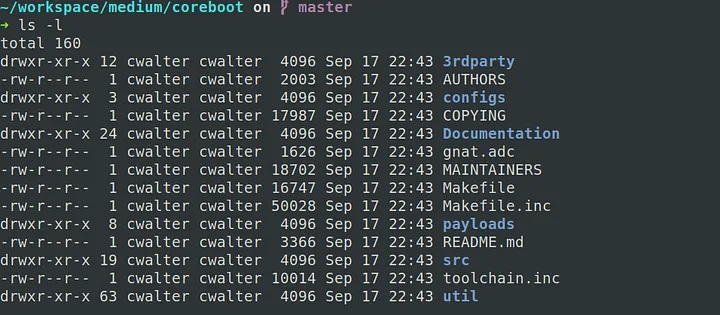
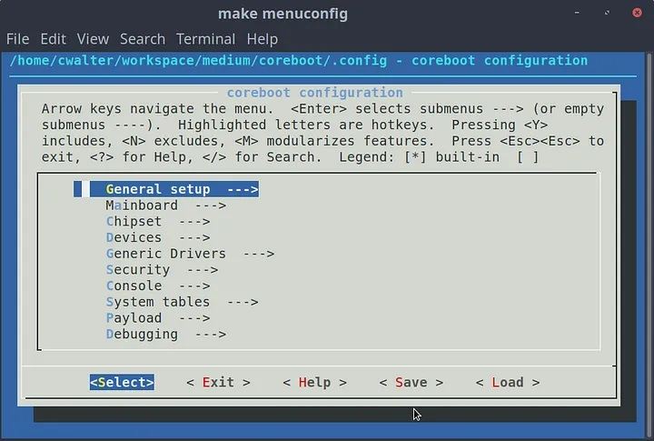
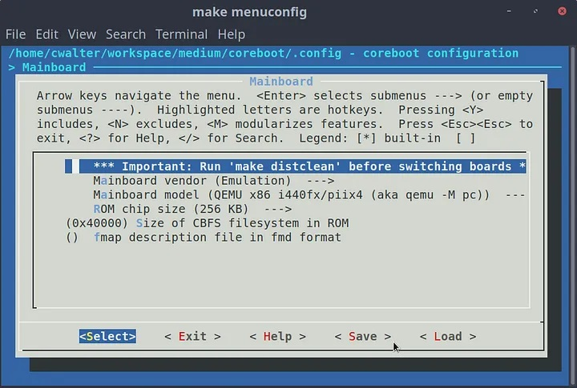
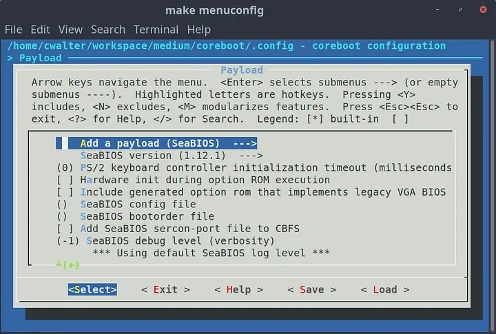
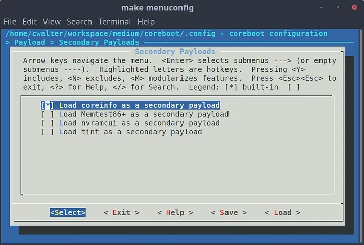

# Coreboot README

Coreboot é um projeto de Software Livre que visa substituir o proprietário firmware (BIOS/UEFI) encontrado na maioria dos computadores. coreboot executa o
inicialização de hardware necessária para configurar o sistema e, em seguida, passa controle para um executável diferente, referido no coreboot como o
payload. Na maioria das vezes, a função principal da carga útil é inicializar o sistema operacional (SO).

Com a separação de inicialização de hardware e lógica de inicialização posterior, coreboot é perfeito para uma ampla variedade de situações. Isso pode ser usado
para aplicações especializadas que rodam diretamente no firmware, rodando sistemas operacionais de flash, carregando bootloaders personalizados ou
implementando padrões de firmware, como serviços de BIOS de PC ou UEFI. Esse flexibilidade permite que os sistemas coreboot incluam apenas os recursos
necessário na aplicação de destino, reduzindo a quantidade de código e espaço flash necessário.

## Código Fonte

Todo o código-fonte do coreboot é armazenado no git. Ele é baixado com o comando:

```bash
git clone https://review.coreboot.org/coreboot.git
```

As revisões de código são feitas em [a instância Gerrit do projeto](https://review.coreboot.org/).

O código pode ser navegado via [instância Gitiles do coreboot](https://review.coreboot.org/plugins/gitiles/coreboot/+/refs/heads/master).

O projeto coreboot também mantém um [espelho](https://github.com/coreboot/coreboot) do projeto no github.
Isso é somente leitura, pois o coreboot não aceita solicitações pull do github, mas permite navegar e baixar a fonte do coreboot.

## Árvore de diretórios do projeto Coreboot



| Diretório da árvore | Conteúdo                                                                                         |
|---------------------|--------------------------------------------------------------------------------------------------|
| 3rdparty            | contém software de terceiros como binários que você pode precisar para inicializar seu hardware; |
| configs             | Configurações de compilação predefinidas para coreboot                                           |
| Documentations      | Há algumas documentações especiais sobre certas placas-mãe ou outros componentes                 |
| payloads            | inclui tudo o que você precisa para construir as diferentes cargas úteis                         |
| util                | contém alguns utilitários com os quais você não precisa se preocupar ainda                       |
| src                 | Contém todo o código-fonte do coreboot                                                           |


## Cargas úteis (payloads)

Após a inicialização básica do hardware ter sido executada, qualquer "carga útil" desejada pode ser iniciada pelo coreboot.

Consulte <https://doc.coreboot.org/payloads.html> para obter uma lista de alguns dos payloads suportados pelo coreboot.


## Hardware suportado

O projeto coreboot oferece suporte a uma ampla variedade de arquiteturas, chipsets, dispositivos e placas-mãe. Embora nem todos estejam documentados, você pode
encontrar algumas informações no [Architecture-specific documentation](https://doc.coreboot.org/arch/index.html) ou no [SOC-specific documentation](https://doc.coreboot.org/soc/index.html).

Para obter detalhes sobre os dispositivos específicos da placa-mãe suportados pelo coreboot, consulte as páginas [Documentação específica da placa-mãe](https://doc.coreboot.org/mainboard/index.html) ou
[Status das Placas](https://coreboot.org/status/board-status.html).


## Versões Publicadas

Atualmente, os lançamentos são feitos por coreboot a cada trimestre. Os arquivos de lançamento contêm toda a base de código do coreboot desde o momento da
o lançamento, juntamente com quaisquer submódulos externos. Os submódulos contendo binários são separados dos arquivos de lançamento geral. Todos
dos pacotes necessários para construir as cadeias de ferramentas coreboot também são mantidos em coreboot.org caso os sites mudem ou esses pacotes específicos
ficarão indisponíveis no futuro.

Todas as versões estão disponíveis na página [download do coreboot](https://coreboot.org/downloads.html).

Observe que os lançamentos de coreboot são melhor considerados como instantâneos da base de código e atualmente não garantem nenhum tipo de extra estabilidade.

## Requisitos de compilação e construção

Se você está usando Debian/Ubuntu seguem os pacotes pré-requisitados

```bash
sudo apt-get install -y bison build-essential curl flex git gnat libncurses5-dev m4 zlib1g-dev qemu
```
### Toolchain kconfig: Invocando a ferramenta de configuração da compilação e construção do binário coreboot
Aqui a idéia é gerar um binário de coreboot que seja compilado específicamente para rodar como "BIOS" no emulador QEMU.

```bash
make menuconfig
```
Segue as telas de configuração:

Navegue até o submenu **mainboard** para escolher a placa-mãe.



Escolha o "modelo" de placa **QEMU x86 i440fx**. O tamanho do chip ROM pode ficar em 256 KB por enquanto. Poderíamos aumentá-lo, QEMU não se importaria com isso. Se escolhermos uma placa-mãe real, o tamanho do chip ROM deve corresponder ao tamanho do chip ROM da placa-mãe. O tamanho do CBFS (Coreboot Filesystem) determina quanto espaço o coreboot deve ocupar no chip ROM. Portanto não precisamos alterar essa opção para este cenário.



Vamos agora adicionar a carga útil (payload). Neste caso por padrão será oferecida como payload uma implementação de BIOS chamada SEABIOS. 



Vamos agora escolher o payload secundário. como opções temos:

| Cargas Secundárias | Descrição                       |
|--------------------|---------------------------------|
| Coreinfo           | Carga secundária para o SEABIOS |
| Memtest86+         | Testador de memória do sistema  |
| nvramcui           |                                 |
| tint               |                                 |



Pressione ESC para sair do menu. Sua configuração de compilação está pronta.

### compilação e construção

A compilação coreboot, utilitários associados e cargas úteis requerem muitas ferramentas e pacotes adicionais para serem compilados. O binário real do coreboot é normalmente construído usando uma cadeia de ferramentas (toolchain) gerenciada pelo coreboot para fornecer reprodutibilidade em várias plataformas. 

```bash
# compilando e construindo utilizando compilação cruzada com a cadeia de ferramentas fornecidas pelo próprio coreboot
make crossgcc-i386 CPUS=${numero_processadores}
```


```bash
# compilando o iasl
make iasl
```

```bash
# construa
make
```


Também é possível, embora não recomendado, fazê-lo diretamente com sua cadeia de ferramentas (toolchain) padrão do sistema. Sistemas operacionais e distribuições vêm com uma variedade desconhecida de ferramentas e utilitários do sistema instalados. Por causa disso, não é razoável listar todos os pacotes necessários para fazer uma compilação, mas o A documentação lista os requisitos para algumas distribuições Linux diferentes.

Para ver a lista de ferramentas e bibliotecas, juntamente com uma lista de instruções para começar a criar o coreboot, acesse a página do tutorial [Começando do zero](https://doc.coreboot.org/tutorial/part1.html).

Você pode testar o resultado diretamente no qemu com os seguintes parâmetros:

```bash
qemu-system-x86_64 -bios build/coreboot.rom -serial stdio
```


## Direitos autorais e licenças

### Arquivos não protegidos por direitos autorais

Existem muitos arquivos na árvore do coreboot que achamos que não são protegidos por direitos autorais devido à falta de conteúdo criativo.

>> "Para se qualificar para proteção de direitos autorais nos Estados Unidos, uma obra deve satisfazer o requisito de originalidade, que tem duas partes. o trabalho deve ter "pelo menos um mínimo" de criatividade e deve ser a criação independente de seu autor."

   <https://guides.lib.umich.edu/copyrightbasics/copyrightability>

Termos semelhantes se aplicam a outros locais.

Esses arquivos não protegidos por direitos autorais incluem:

- Arquivos vazios ou arquivos com apenas um comentário explicando sua existência. Pode ser necessário que existam como parte do processo de construção, mas não são necessários para o projeto específico.
- Arquivos de configuração em formato binário ou de texto. Exemplos seriam arquivos como arquivos .vbt descrevendo a configuração gráfica, arquivos spd como .spd binário ou texto \*spd\*.hex representando a configuração do chip de memória.
- Arquivos gerados por máquina contendo números de versão, datas, valores de hash ou outro conteúdo "não criativo".

Como conteúdo não criativo, esses arquivos são de domínio público por padrão. Como tal, o projeto coreboot os exclui da licença geral do projeto, mesmo que possam ser incluídos em um binário final.

Se houver dúvidas ou preocupações sobre esta política, entre em contato com o projeto coreboot através da lista de discussão.

### Direitos autorais

Os direitos autorais do coreboot pertencem a um grande número de desenvolvedores e empresas individuais. Uma lista de empresas e indivíduos com
as reivindicações de direitos autorais estão presentes no nível superior da árvore de origem do coreboot no arquivo 'AUTHORS'. Verifique o histórico git de cada um dos arquivos de origem para obter detalhes.

### Licenças

Devido à forma como o coreboot começou, usando uma quantidade significativa de código-fonte do kernel do Linux, ele é licenciado da mesma forma que o Linux
Kernel, com GNU General Public License (GPL) Versão 2. Arquivos individuais são licenciados sob várias licenças, embora todas sejam compatíveis
com GPLv2. A imagem coreboot resultante é licenciada sob a GPL, versão 2. Todos os arquivos de origem devem ter um identificador de licença SPDX em
o topo para esclarecimentos.

Os arquivos em coreboot/Documentation/ são licenciados sob os termos CC-BY 4.0. Como exceção, os arquivos em Documentação/ com histórico anterior a 24/05/2017 podem estar sob licenças diferentes.

Os arquivos no diretório coreboot/src/commonlib/bsd são todos licenciados com a licença BSD-3-clause. Muitos também possuem licença dupla GPL-2.0-only ou GPL-2.0-or-later. Esses arquivos devem ser compartilhados com libpayload ou outros projetos licenciados BSD.

O projeto libpayload contido em coreboot/payloads/libpayload pode ser licenciado como BSD ou GPL, dependendo do código extraído durante o processo de compilação. Todo o código-fonte GPL deve ser excluído, a menos que o Kconfig opção para incluí-lo está definida.

## A Conservação da Liberdade de Software

Desde 2017, a coreboot é membro da [The Software Freedom Conservancy](https://sfconservancy.org/), uma organização sem fins lucrativos dedicada à tecnologia ética e à condução de iniciativas para tornar a tecnologia mais inclusiva. A conservação atua como patrocinador fiscal e consultor jurídico do coreboot.
